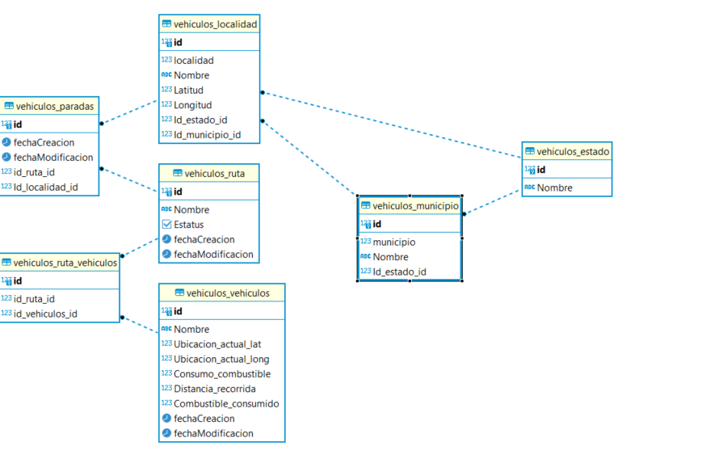

# PRUEBA Eiya 
## Realizada por Humberto montes de Oca <humbertoha18@gmail.com>

Prueba solicitada por parte de eiya
Productos utilizado
- Docker
- Django app
- React
- Postgresql


## docker-compose file
```yaml
version: '3'

services:
  dbeiya:
    image: postgres
    env_file:
      - ./.envs/.postgres
    ports:
      - "5432:5432"
    volumes:
      - /opt/postgres-dataeiya:/var/lib/postgresql/data
    networks:
      - db-neteiya
  django:
    build: ./api
    command: bash -c "python manage.py migrate && python manage.py runserver 0.0.0.0:8000"
    env_file:
      - ./.envs/.postgres
    volumes:
      - ./api:/app/api
    ports:
      - "8000:8000"
    depends_on:
      - dbeiya
    networks:
      - db-neteiya
  frontend:
    restart: always
    build: ./frontend
    environment:
      NODE_ENV: development
      CHOKIDAR_USEPOLLING: "true"
    command: npm start
    volumes:
      - ./frontend:/app/frontend
      - /frontend/node_modules
    ports:
      - "3000:3000"
    depends_on:
      - django
    networks:
      - db-neteiya
networks:
  db-neteiya:
    driver: bridge
```
## Base de datos



## Requerimientos

Esta prueba se construyo con docker-compose se necesita que este instalado 
enlace de descarga en 
windows 
https://desktop.docker.com/win/main/amd64/Docker%20Desktop%20Installer.exe
linux
Consulta la instalacion de tu distribucion

## Para empezar
```sh
git clone https://github.com/humbertoha/pruebaeysa.git
cd pruebaeysa
docker-compose build
```
Para cargar el catalogo de Estado ,municipio y localidad 
informacion obtenida del Inegi https://www.inegi.org.mx/app/ageeml/ Catálogo Único de Claves de Áreas Geoestadísticas Estatales, Municipales y Localidades
Es la informacion con longitud y latitud de todas las localidades del INegi tarda 10 min por las relaciones
se creo un comando de django para cargarla 

```sh
 $ docker-compose -f .\docker-compose.yml run --rm django python manage.py  base_data_localidad
```
si se desea acceder al admin se necesita crear el superusuario

```sh
 $ docker-compose -f .\docker-compose.yml run --rm django python manage.py  createsuperuser
```
Se utilizo axios para la comunicacion entre react django 

Para leventar el servicio 
```sh
 $ docker-compose up
```

si tiene problema de "react not found" ejecutar 
```sh
 $ docker-compose -f .\docker-compose.yml run --rm django frontend  npm install
```


## Django app
http://127.0.0.1:8000

admin 
http://127.0.0.1:8000/admin

## React app
http://127.0.0.1:3000